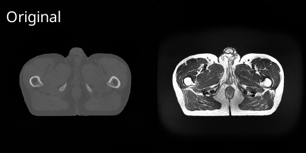
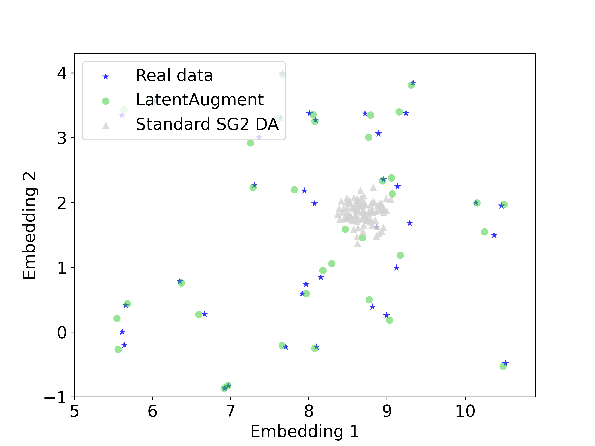

# LatentAugment: Data Augmentation via Guided manipulation of GANs Latent Space

This repository contains the official PyTorch implementation of LatentAugment, a Data Augmentation (DA) policy that steers the Generative Adversarial Network (GAN) latent space to increase the diversity and quality of generated samples.

## LatentAugment Features

- Increases the diversity and quality of synthetic samples from GANs;
- Increases the effectiveness of GANs when used for DA purpose; 
- Allows  more complex types of transformations to common DA methods (e.g., rotation, translation, and scaling);
- Does not require prior knowledge of the dataset;
- Can be implemented with any GAN;

<p float="left">
  
</p>

## Installation

### Clone the repository

```bash
git clone
cd LatentAugment
```

### Install dependencies
For pip users, please type the following commanda to install dependencies:
```bash
pip install -r requirements.txt
```
For Conda users, you can create a new Conda environment using the following command:
```bash
conda env create -f environment.yml
```
The code was tested with Python 3.9.12, PyTorch 1.9.1, CUDA 11.1 and Ubuntu 22.04.2 LTS.
For more informations about the requirements, please check the requirements.txt or environment.yml files.
All the experiments used a single NVIDIA RTX A5000 GPU.

## Usage
### Prerequisites

- Pretrained GAN model on the target dataset.
- Latent codes of real training samples.
- Create your own dataset module, check the page [data](https://github.com/junyanz/pytorch-CycleGAN-and-pix2pix/blob/master/docs/datasets.md) for more details.

In our experiments we used StyleGAN2 (SG2) and the inversion procedure from in the official SG2 repository [stylegan2-ada-pytorch](https://github.com/NVlabs/stylegan2-ada-pytorch.git).
You are free to use whatever GAN or inversion procedure you want.

To use LatentAugment in your downstream applications please follow the steps below:
```python
from augments import create_augment
from data import create_dataset

from options.aug_options import AugOptions

opt = AugOptions().parse()  # get training options

dataset = create_dataset(opt)  # create the dataset object given opt.dataset_mode and other options
augment = create_augment(opt)  # create the augment object given opt.aug and other options

for i, data in enumerate(dataset):  # loop on training data
    
        # Perform augmentation.
        augment.set_input(data) # Set input for augmentation.
        augment.forward() # Perform the augmentation.
        data_aug = augment.get_output() # Get output from augmentation.
        
        # Train the downstream model.
        # ...
```

- See the [options](./options) folder for more details about the options.
- See the [data](./data) folder for more details about the dataset module.
- See the [augments](./augments) folder for more details about the augmentation methods.

## Results

<p float="left">
  
</p>

We use UMAP dimensionality reduction to visualise the behaviour of LatentAugment and SG2 synthetic samples in relation to real image latent codes.
We initially fit UMAP using the latent codes of real samples, which are depicted as blue stars. 
Then, we project the latent codes of the real, LatentAugment, and SG2 samples onto this space; LatentAugment samples are represented by green circles and SG2 samples by white triangles

We observe that SG2 samples only cover a small portion of the real manifold, while LatentAugment samples cover all the real manifold. 
Moreover, LatentAugment samples do not overlap the real samples ensuring diversity. Yet, these samples are near the real latent codes, suggesting high-quality generation.

For a complete visualisation of the UMAP manifold, download the [interactive plot](https://ltronchin.github.io/LatentAugment/) created using Bokeh. We suggest to open it on your browser.

## Citation
If you use this code in your research, please cite our paper: [LatentAugment: Data Augmentation via Guided manipulation of GANs Latent Space]()

## Acknowledgements
This code is based on the following repositories:
- [stylegan2-ada-pytorch](https://github.com/NVlabs/stylegan2-ada-pytorch.git)
- [pytorch-CycleGAN-and-pix2pix](https://github.com/junyanz/pytorch-CycleGAN-and-pix2pix.git)

## Contact for Issues

If you have any questions or if you are just interested in having a virtual coffee about Generative AI, 
please don't hesitate to reach out to me at: [l.tronchin@unicampus.it](l.tronchin@unicampus.it).

May be the AI be with you!

## License

This code is released under the MIT License.
